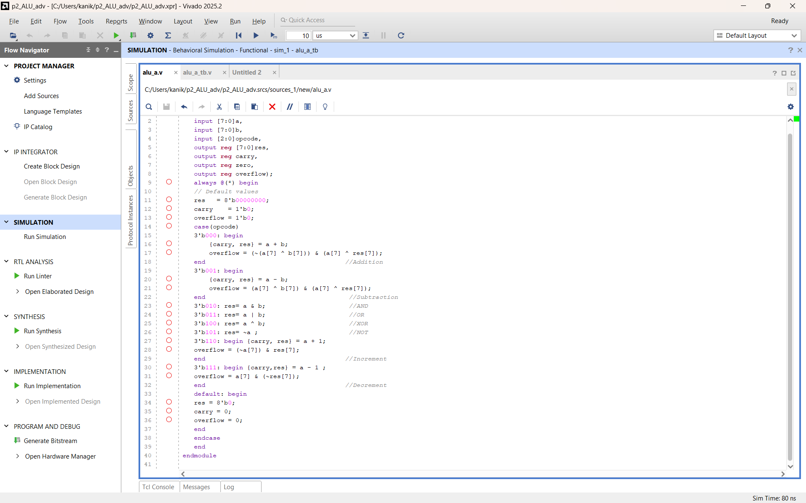
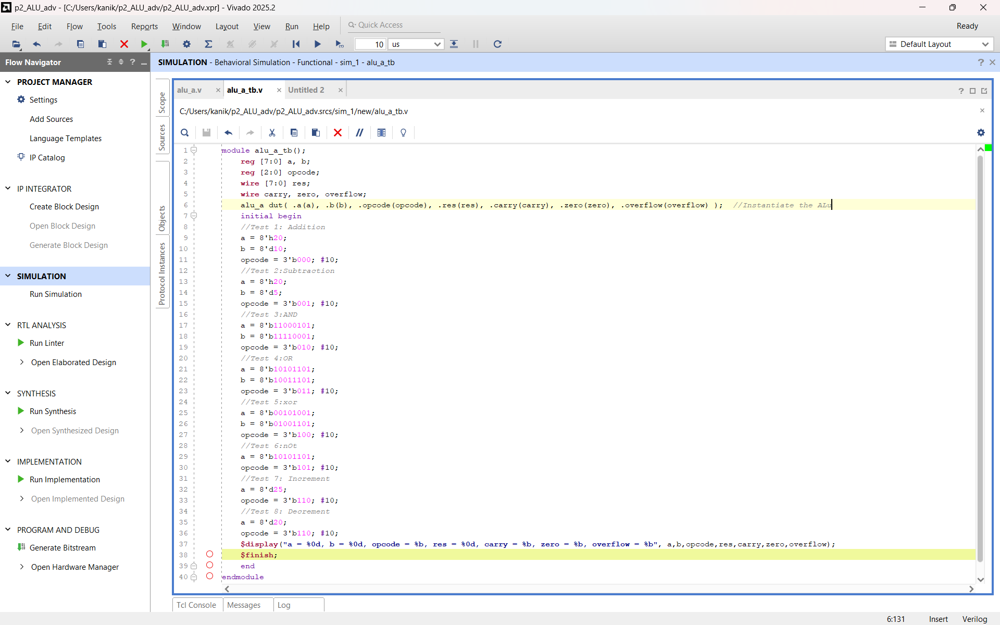
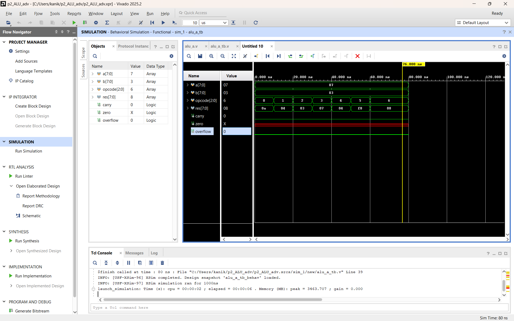
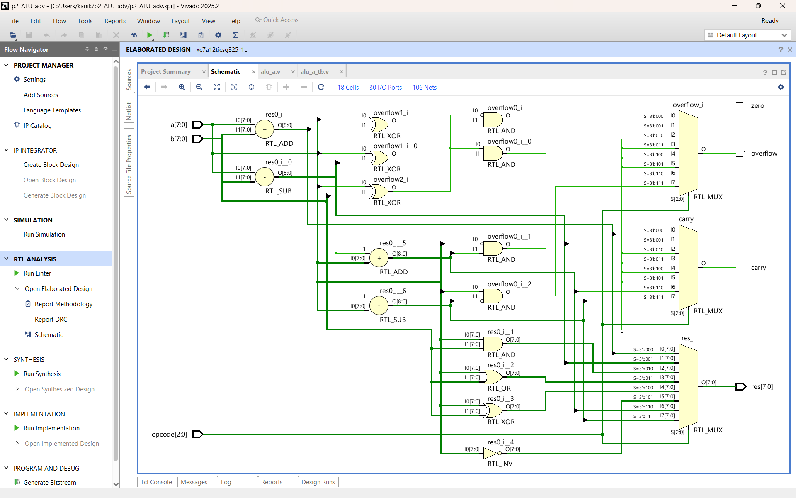

# 🔥 8-Bit Arithmetic Logic Unit (ALU) using Verilog

## 📌 Project Overview

This project implements an 8-Bit Arithmetic Logic Unit (ALU) using Verilog HDL and verifies its functionality using a custom testbench in Xilinx Vivado.

The ALU is a fundamental component of digital processors, responsible for performing arithmetic and logical operations based on a control signal (`sel`).

This project was developed as part of my VLSI Design & Verification learning journey.

---

## 🚀 Features

The ALU supports the following operations:

| Select (sel) | Operation |
|-------------|-----------|
| 000 | Addition (A + B) |
| 001 | Subtraction (A - B) |
| 010 | Bitwise AND |
| 011 | Bitwise OR |
| 100 | Bitwise XOR |
| 101 | Bitwise NOT (~A) |
| 110 | Increment (A + 1) |
| 111 | Decrement (A - 1) |

---

## 🛠️ Tools Used

- Verilog HDL
- Xilinx Vivado 2025.2
- Behavioral Simulation

---

## 📂 Project Files

- `alu.sv` → ALU Design Module
- `alu_tb.sv` → Testbench for Verification

---

## 🧪 Verification

### Test Inputs

```text
A = 7
B = 3
```

### Simulation Results

| Operation | Result | Carry | Overflow | 
|------------|---------| ------ | ------ |
| 7 + 3 | 10 | 0 | 0 |
| 7 - 3 | 4 | 0 | 0 |
| 7 AND 3 | 3 | 0 | 0 |
| 7 OR 3 | 7 | 0 | 0 |
| 7 XOR 3 | 4 | 0 | 0 |
| NOT 7 | 248 | 0 | 0 |
|  7 + 1 | 8 | 0 | 0 |
| 7 - 1 | 6 | 0 | 0 |

All operations were successfully verified through behavioral simulation.

---

## 📸 Screenshots

### RTL Design



### Testbench



### Simulation Waveform



### RTL Schematic



---

## 🎯 Learning Outcomes

Through this project, I gained hands-on experience in:

- Verilog HDL Coding
- Combinational Logic Design
- RTL Development
- Testbench Writing
- Functional Verification
- Simulation and Debugging
- Vivado Design Flow

---

## 🔮 Future Improvements

- Parameterized ALU Design
- SystemVerilog Testbench

---

## 👨‍💻 Author

**Chandrasekhar Kanike**

B.Tech Electronics and Communication Engineering (ECE)

### Areas of Interest

- VLSI Design
- Design Verification
- FPGA Development

### Connect with Me

- GitHub: https://github.com/Chandrasekhar016

---

⭐ If you found this project useful, consider giving it a star.
